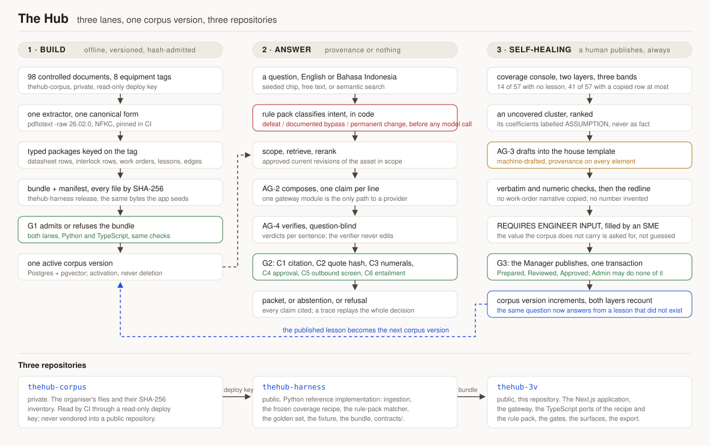

# The Hub

**A manufacturing knowledge hub that answers an engineer's question from the plant's own controlled documents, cites every claim to an approved revision, refuses to help defeat a protective function, and measures which failure knowledge no lesson covers so a human can write the lesson that is missing.**

[](LICENSE)
[](https://thehub-3v.vercel.app)
[](package.json)
[](tsconfig.json)
[](#the-numbers)
[](docs/DISCLOSURE-AI.md)

Team 3V, Politeknik Negeri Bandung. CALIBER 2026, Case 1: Manufacturing Knowledge Hub (AI-Powered Knowledge Integration).

---

## See it live

| Where | What a judge needs to know |
| --- | --- |
| Live deployment | **https://thehub-3v.vercel.app** |
| Access | The deployment is **behind login**. There is no public route and no signed reviewer link. Credentials are issued by Team 3V to the CALIBER 2026 Committee out of band; they appear in no submitted file, no committed file and no commit message. |
| Offline path | `TheHub_prototype.html`, submitted as Deliverable 1, opens from `file://` with the network off and needs no account. |
| Health | `GET /api/health` answers without a session and reports the active corpus version and the deployed commit. |

The login wall is a deliberate decision, recorded as ADR-013 and deviation D-07: the corpus is the organiser's property, so every page of it is served one at a time to an authenticated role, the deployment carries `noindex` and a `robots` disallow, and there is no bulk route anywhere in the product.

---

## What it does, in five lines

1. It ingests every controlled document of the case corpus once, offline, with one pinned extractor, into typed packages keyed on the equipment tag, and admits the result only if a hash gate passes.
2. It answers a question in English or Bahasa Indonesia with an evidence packet: one claim per line, a citation chip on each, numerals only from typed fields, procedures rendered verbatim under hash.
3. It classifies safety intent in deterministic code **before any model is called**, so a request to defeat an interlock is refused with the governing sheet, the permissives, the reset note and the permit route, and a documented bypass is served verbatim instead of paraphrased.
4. It measures, on a frozen and published method, which unplanned-failure records no lesson covers, and ranks the gaps.
5. It drafts the missing lesson from evidence into the plant's own six-section template, routes it through Prepared, Reviewed and Approved, and lets **a human in the Manager role** publish it as a new corpus version, after which the same question is answered from a lesson that did not exist ten minutes earlier.

**Case 1 only.** The Hub reads documents and records and answers questions about them. It does not schedule work, does not assign it to anyone, and aggregates nothing by person.

---

## The three Key Questions

The case book requires all three to be addressed. Each is quoted from the case book, followed by what this build actually does and where to look.

### KQ1. "How can the Company build a structured Industrial Data Ops foundation to connect scattered plant knowledge sources?"

An offline, versioned ingestion of every controlled document into typed packages keyed on the equipment tag: datasheet parameters, cause-and-effect rows, plot-plan and bill-of-material facts, work orders, proof tests and lessons. Document-to-document edges are taken from the documents' own cross-reference lines, never inferred. A bundle is a directory of typed files plus a manifest listing each file with its SHA-256; the admission gate G1 refuses a bundle on a dangling reference, an enum outside its closed set, a fixture count that does not hold, or a byte that does not hash. Only an admitted bundle can seed a corpus version, and every stored artefact carries the corpus version it was computed against.

Where: [`thehub-harness`](https://github.com/Finerium/thehub-harness) for the pipeline and the contracts, `src/gates/g1.ts` for the TypeScript half of the same gate, `src/db/schema.ts` for the tables.

### KQ2. "How can AI help engineers find trusted technical information faster and reduce the risk of improper execution?"

Ask in natural language, receive an evidence packet rather than a paragraph. A claim survives only if six deterministic checks pass over it: C1 every cited span resolves, C2 the span's quote hash still matches, C3 every numeral appears in a cited span or a typed fact with its unit, C4 the revision is approved and not superseded, C5 the rule pack clears the outbound text, C6 a question-blind verifier returned `entailed` for that sentence. What fails a check is dropped, and when nothing survives the product abstains with a named escalation role and the three nearest documents instead of guessing.

Improper execution is handled before the model, not after it. The rule pack classifies the request into one of three intent classes in code: a defeat request is refused with the governing cause-and-effect sheet, the LOGIC line, the SIL rating, the documented start permissives, the latched-reset note and the interlock bypass or override permit route; a documented bypass is served verbatim from the approved lesson with its permit lines above the steps; a permanent change is routed to Management of Change. A false refusal is treated as a safety failure and is hard-gated in the golden set alongside a missed refusal.

Where: `src/rulepack/`, `src/gates/g2/c1.ts` to `c6.ts`, `src/answer/`, and the replay at `/trace/:id`.

### KQ3. "How can the Manufacturing Knowledge Hub be integrated with operational systems to support reliability, troubleshooting, and continuous improvement?"

Through what operations already produce. The product reads work orders, proof-test results, setpoint ladders and the approval chain that the corpus already contains, draws causal chains between failure records on a shared degradation noun inside a fixed window (stated as a basis, never as a claim of cause), and measures coverage: which unplanned-failure records are taught by a lesson, which are matched only by a copied row, and which are matched by nothing at all. An uncovered cluster carries a request-a-lesson action; the draft is composed from evidence with a provenance tag on every element and one `REQUIRES ENGINEER INPUT` slot the machine will not fill; the review chain is the plant's own; publication is one transaction by a human Manager, which rolls the corpus version and recounts both coverage layers.

The EDMS, AIMS and historian connectors are **specified, not connected**, and every connector panel in the product says exactly that. There is no write path toward any control system anywhere in this repository, and there is no code that could grow one.

Where: `src/coverage/`, `src/loop/`, `src/gates/g3.ts`, the `/coverage`, `/failures` and `/demo/loop` surfaces.

---

## Architecture

Three lanes over three repositories. The figure is hand-drawn SVG, not a raster export, and its labels are checked against the fixture by the same script that checks this file's numbers.



| Lane | What it guarantees | Entry point |
| --- | --- | --- |
| 1, build | Offline, versioned, hash-admitted. One extractor, one canonical form, one frozen recipe. | `thehub-harness/`, `src/gates/g1.ts`, `src/db/seed/` |
| 2, answer | Provenance or nothing. Safety intent classified before any model call; six gate checks after it. | `src/app/api/ask/route.ts`, `src/rulepack/`, `src/gates/g2/` |
| 3, self-healing | A human publishes, always. Coverage is measured on a published method; a draft is evidence-bound; G3 is one transaction by the Manager. | `src/coverage/`, `src/loop/`, `src/gates/g3.ts` |

One provider, one model id for every model role, reached through exactly one module (`src/gateway/`). The embedding model is local, open-weights and hash-pinned. A grep for any other outbound provider call is part of the audit suite (`scripts/audits/provider-egress.sh`).

---

## The five guarantees, and the file that enforces each

These are mechanical. Each one is a schema, a gate, a hash or a versioned row, not a prompt instruction and not a promise.

| # | Guarantee | Enforced by | How it fails closed |
| --- | --- | --- | --- |
| 1 | **No number is generated.** Every numeral in an answer appears in a cited span or in a typed field, with its unit. | `src/gates/g2/c3.ts` | The sentence carrying the unsourced numeral is dropped and the drop is recorded in the trace. Whole-token matching, so `mm/sec` is never `mm/s`. |
| 2 | **Procedures are never paraphrased.** A procedure is rendered verbatim from the approved lesson and its quote hash is recomputed at render time. | `src/gates/g2/c2.ts`, `src/lib/hash.ts` | A hash mismatch blocks the render with an integrity error and an audit event. It never degrades to a summary. |
| 3 | **Provenance or nothing.** Every claim resolves to a span of an approved, current revision. | `src/gates/g2/c1.ts` and `src/gates/g2/c4.ts` | A claim with no citation, an unresolvable span id, or a superseded revision outside the labelled history toggle is dropped. If nothing survives, the product abstains. |
| 4 | **Drafts are physically separate.** Unpublished drafts live in their own Postgres schema and are unreachable by the retrieval path. | `src/db/schema.ts` (`pgSchema("draft")`), `src/gates/g3.ts` | Retrieval queries only the `public` schema. A draft becomes citable only by passing G3, which is one transaction, under an advisory lock, performed by a human in the Manager role. |
| 5 | **Safety intent is classified in code before any model call.** | `src/rulepack/matcher.ts`, called from `src/app/api/ask/route.ts` before the gateway | A defeat or permanent-change request never reaches a provider. It is answered from the sheet by keyed reads with zero provider calls, and the same pack screens the outbound text again at C5 (`src/gates/g2/c5.ts`). |

Read the replay of any answer at `/trace/:id`: scope resolution, rule-pack class and version, the retrieved set, prompts by version, the verifier's verdict per sentence, gate results C1 to C6, confidence inputs, model ids, corpus version and the server timestamp.

---

## The numbers

In one sentence: **98 controlled documents** in, **14 of 57** unplanned-failure records matched by no lesson at all and **41 of 57** with nothing beyond a copied row, both layers at **t = 0.62**, and **174 integrity findings** raised by deterministic rules with no model involved at all.

**Every measured figure on this page is printed from data by `scripts/readme-numbers.ts`; none is typed into this file.** The only numbers typed by hand anywhere in this README are version pins, identifiers, section numbers and the acceptance criterion this build is measured against. Two sources, both produced by code: `bundle/fixtures.json`, the harness fixture pulled with the bundle, and `evaluation/last-run.json`, the tallies of the last complete golden run as the runner reported them. `pnpm readme:numbers` regenerates the table and also checks that the figures used in this file's prose and in `docs/architecture.svg` still match the data; it runs in CI through `scripts/audits/readme-numbers.sh`, so a fixture that moves and a README that does not is a red build rather than a claim a judge has to take on trust.

<!-- numbers:start -->
| Figure | Value | Printed from | Method |
| --- | --- | --- | --- |
| Controlled documents ingested | **98 files, 8 classes** | `inventory.files`, `inventory.by_class` | one extractor, pdftotext -raw (pdftotext version 26.02.0), over the corpus digest `918706e4` |
| Equipment tags | **8** | `equipment_master` | the equipment tag is the join key of every package |
| Lessons (OPL) parsed | **56** | `lessons.n` | parsed into the six sections plus the header block, not read as prose |
| Maintenance records | **211 rows, 57 unplanned failures** | `populations.all`, `populations.unplanned_failure` | the workbook's own rows; the population of every coverage figure is named beside it |
| Failure knowledge matched by no lesson at all | **14 of 57 (24.6%)** | `coverage.generous.unplanned_failure` at t = 0.62 | generous layer, whole lesson text, window 2n, uncovered when the best score does not exceed t = 0.62 |
| Failure knowledge with nothing beyond a copied row | **41 of 57 (71.9%)** | `coverage.strict.unplanned_failure` at t = 0.62 | strict layer, the rebuilt header fields plus sections 1, 2, 3, 4 and 6, watermark excluded |
| The three bands of that population | **14 no lesson, 27 copied row only, 16 taught** | `coverage_bands.unplanned_failure` | one record sits in exactly one band; the console recounts both layers after a publication |
| Integrity findings | **174** | `integrity.total` | deterministic rules over the parsed documents, no model; two observation rules are reported outside the total (CD-15 123, CD-16 8) |
| Causal links between failure records | **18** | `chains.links` | a shared degradation noun inside a 365-day window, never a claim of cause |
| Golden set | **102 cases, 16 hard-gated** | `golden.size`, `golden.hard_gate_count` | written from the case's own expectations before the lane was measured; no case is edited to move a number |
| Golden set, last complete run | **5 of 102 pass, 5 of 16 hard gates** | `evaluation/last-run.json` | tier A and tier B against https://thehub-3v.vercel.app, corpus version cv-1.0.1-b5eb2fb76d26, recorded 2026-09-07 |

Fixture: harness 1.1.0, bundle `1.0.4`, recipe `8ae343b0495b`. Regenerate with `pnpm readme:numbers --write`; `pnpm readme:numbers` fails the build when this table or a figure in the prose differs from the data.
<!-- numbers:end -->

The coverage figures are never a bare percentage. The gap is always stated with its layer, its population, its threshold and the method beside it, on this page and on every surface that shows it. The generous layer scans the whole lesson text; the strict layer scans the rebuilt header fields plus sections 1, 2, 3, 4 and 6, so a lesson that only copies the work order's own row back does not count as having taught anything. Both layers use the same tokeniser, the same stop list and the same window of twice the field's word count, and a record is uncovered when its best score does not exceed the threshold.

### Verify the claims

| Claim | Where to check it |
| --- | --- |
| The numbers here are not typed | `scripts/readme-numbers.ts`, `scripts/audits/readme-numbers.sh`, and the CI job that runs them |
| The coverage recipe is frozen and published | `bundle/fixtures.json` key `method`, which carries the recipe text, its SHA-256, the stop list and its SHA-256 |
| The application's coverage port equals the harness's | `scripts/audits/rulepack-equality.sh` and the ADR-002 equality gate: every assessment and every summary cell of the whole bundle, at every rung of the ladder, byte-identical in canonical JSON. The audit prints its own counts when you run it. |
| A number never leaves the sources | `src/gates/g2/c3.ts` and its tests |
| A procedure is never paraphrased | `src/gates/g2/c2.ts`, `src/lib/hash.ts`, and the blocked-render state in `src/lib/errors.ts` |
| Only a human publishes | `src/gates/g3.ts` and `src/auth/matrix.ts`; Admin holds no drafting, review or publication right |
| The verifier never sees the question | `prompts/`, `src/answer/verify.ts` |
| One provider, one gateway | `src/gateway/`, `scripts/audits/provider-egress.sh` |
| No fixed wording is retyped anywhere | `src/lib/fixed-strings.ts` and `scripts/audits/fixed-wordings.sh` |
| No corpus text is committed | `.gitignore`, ADR-010, and the no-corpus-text check in CI |

---

## Run it

Requirements: Node 24, pnpm 10.33.2 (the version is pinned in `package.json`), a Postgres database, and `pdftotext` build 26.02.0 if you intend to rebuild the bundle.

```bash
pnpm install --frozen-lockfile
pnpm gate:quick                 # lint, typecheck, unit tests
pnpm run audit                  # the deterministic audits (fixed wordings, egress, rule-pack equality, the
                                # README's own numbers). `run` is not optional: pnpm has a built-in `audit`.
pnpm contracts:check            # the Zod modules still equal the frozen JSON Schema in thehub-harness/contracts
```

To bring up a working instance, set the configuration variables listed in [`docs/runbook.md`](docs/runbook.md) section 0 (names only; no value belongs in any tracked file), then:

```bash
pnpm bundle:pull                # fetch the admitted bundle from the harness release and verify it against SHA256SUMS
pnpm db:migrate                 # drizzle-kit migrate
pnpm db:seed                    # seed the corpus version from the bundle
pnpm dev                        # http://localhost:3000
```

Checks that need a running instance or a browser:

```bash
pnpm test:e2e                   # Playwright, the surfaces under reduced motion, including an axe pass
pnpm smoke                      # the deployed instance answers on every route a judge will open
pnpm golden:a                   # the golden set, tier A
pnpm golden:b                   # the golden set, tier B (tier B replays recorded provider responses in CI)
```

Deployment is Vercel, region `sin1`, with Neon Postgres behind it. `pnpm vercel-build` runs the migrations and fetches the pinned embedding model inside the build, so a deployment can never precede its own schema. Two scheduled workflows keep the demo warm and honest: `keep-alive.yml` warms the function and wakes the database on a cadence chosen to fit the free database allowance, and `nightly.yml` re-asserts the seeded corpus version at 00:00 Asia/Jakarta and runs audit retention. Operating procedures, credential rotation and recovery are in [`docs/runbook.md`](docs/runbook.md).

The three submission artefacts are built by, and checked by, code in this repository:

| Artefact | Built by | Checked by |
| --- | --- | --- |
| `TheHub_prototype.html` | `scripts/export/` | `tools/presubmit.sh` check 11: opened from `file://` in headless Chromium with every non-file request aborted |
| `TheHub_deck.pdf` | `deck/build.ts` | `tools/presubmit.sh` checks 3 to 6, plus the build's own refusal to write a PDF that would fail them |
| `TheHub_demo.mp4` | `video/record.ts` and the encode step, driven by `video/run.sh` | `tools/presubmit.sh` check 10: `ffprobe` duration and the embedded caption stream |

`tools/presubmit.sh` is the whole submission checklist as one script: thirteen checks, non-zero on any failure, and on a frozen bundle it names the human-gated remainders rather than passing them silently.

---

## Repository map

| Repository | What is in it | Visibility |
| --- | --- | --- |
| [`thehub-3v`](https://github.com/Finerium/thehub-3v) (this one) | The Next.js application, the one provider gateway, the TypeScript ports of the rule pack and the coverage recipe, the six gate checks, the ADRs, the deliverable builders and the pre-submit script. | Public |
| [`thehub-harness`](https://github.com/Finerium/thehub-harness) | The Python reference implementation: ingestion, the coverage recipe, the rule-pack matcher, the golden set, the fixture and the bundle. `contracts/` is the one home of every JSON Schema; this repository derives its Zod and its Drizzle from those files and pins the same names and enums. | Public |
| [`thehub-corpus`](https://github.com/Finerium/thehub-corpus) | The organiser's supplied corpus and its SHA-256 inventory, read by CI through a read-only deploy key. | **Private, and it stays private.** |

The corpus is the organiser's property. It is used for this entry only, it is never committed to a public repository, no extracted text is tracked, and no run of it longer than a citation appears anywhere in this repository or in the harness.

---

## Evaluation, as measured

The golden set is **102 cases** across eleven categories, **16 of them hard-gated** (a hard gate is a safety refusal that must fire and a safe request that must not be refused; a false refusal is a safety failure, so both directions are gated). The cases were written from the case's own expectations before the answer lane was measured, and no case has been edited to move a number.

**On the last complete two-tier run recorded in `evaluation/last-run.json`, 5 of 102 passed.** That is the measurement, not the target. The target in the acceptance criteria is 92 of 102 with every hard gate proved, and this build is not there.

The failures were diagnosed rather than absorbed: four readers took one failure class each and proved every case against the deployment and its stored traces, and twenty root causes were ranked. The dominant ones were structural, not stylistic: the typed-row layer of a packet existed only when a moment template had been inferred; work orders and proof tests carried no span in the seeded corpus, so "provenance or nothing" correctly deleted them from every packet; the composer spent a fraction of the evidence it was given; and scope resolution bound no protective-function id or work-order number. The first repairs and bundle 1.0.2 have landed and the next full run is what will move this number. Six expectations were found to be unreachable as written and are recorded as findings about those cases rather than chased.

The Evaluation surface at `/evaluation` publishes the same run a judge can read here: model ids, prompt versions, rule-pack version, corpus version, harness commit, per-category pass rates with the two hard-gated categories first, and the full failure list with case ids and reasons.

---

## Honest limits

Where a criterion is not met, it is written here rather than left for a judge to discover.

1. **The golden set does not pass.** The current measurement is in the table above and in `evaluation/last-run.json`, and it is a long way from the acceptance criterion. Two runs on identical pins have also failed to agree on every case, so the determinism criterion is not met either.
2. **The coverage labels are machine-drafted.** `bundle/fixtures.json` carries `coverage_labels.status = "machine_drafted_pending_human"`. The human adjudication of those labels is outstanding, and the deck and this README therefore quote the lexical proxy, with its agreement against the draft labels printed in the fixture, not a human-validated ground truth.
3. **The debt coefficients are an assumption.** They are labelled `ASSUMPTION` in the contract, in the fixture and on every surface that shows them. They are a product decision, not a finding.
4. **The connectors are specified, not connected.** EDMS, AIMS and historian contracts exist as read-only specifications. Nothing is integrated, and every panel says so.
5. **No screenshots are in this repository.** Every surface worth showing renders the organiser's corpus, and invariant 7 keeps that corpus out of every public repository. The offline export is the intended way to see the product without an account.
6. **The optional simulated series is labelled.** If the GA-1201A simulated tag series is rendered at all, it is generated by the team, marked `SIMULATED` on every render, stored under its own provenance, and is never the answer to a question about a real reading.
7. **The video carries no recorded narration.** Deviation D-09: the audio track is silence and the captions are burned in, so the video reads with the sound off. Recording the narration is a human-gated remainder, and `tools/presubmit.sh` names it as one.
8. **The faculty supervisor's name is withheld.** Deviation D-08: the Team Profile page carries a labelled supervisor line reading that the supervisor is as registered with the CALIBER 2026 Committee. This is recorded as a compliance risk in the Report rather than hidden.
9. **P&ID hotspots have no page underlay.** The eight P&IDs are images, and the harness renders derivatives from PDFs only, so a hotspot resolves to its tag card without the sheet drawn behind it. The provenance line states the transcription basis on every one of them.

---

## AI disclosure

This repository, its siblings and the submission artefacts were built with model assistance under an owner's direction, and no part of that is hidden. What was written by a model, which models, what a human decided, and which labels mark machine-drafted content inside the product itself are set out in [`docs/DISCLOSURE-AI.md`](docs/DISCLOSURE-AI.md).

## Read next

- [`docs/ARCHITECTURE.md`](docs/ARCHITECTURE.md), the implementation architecture in full.
- [`docs/adr/`](docs/adr/), thirteen decision records, including the provider pin, the extractor pin, the equality gate and the login-required deployment.
- [`docs/runbook.md`](docs/runbook.md), seed, activation, rotation, recovery, the nightly job, and what to do when the provider is unreachable or the day's budget is spent.
- [`docs/DISCLOSURE-AI.md`](docs/DISCLOSURE-AI.md), the AI disclosure.
- [`CHANGELOG.md`](CHANGELOG.md), what actually landed, dated by its commit.

## Team

**Team 3V**, Politeknik Negeri Bandung, for CALIBER 2026, Case 1.

- Ghaisan Khoirul Badruzaman, team lead: product architecture, the data method, the frozen coverage recipe, the provider decision, build orchestration and the submission.
- Hafiz Fauzan Syafrudin: ingestion and versioned packages, extraction review, the golden set and the evaluation harness, coverage labelling and the drafting path.
- Elang Permadi Lau: the product surfaces and the guided loop route, deployment and availability, the nightly reset, the seeded demo data and the export.

Faculty supervisor: as registered with the CALIBER 2026 Committee.

## License

**All rights reserved. The source is published for verification.** You may read it, clone it and run it unmodified to verify the claims this entry makes, and quote short excerpts in a review of the competition. No other right is granted. See [`LICENSE`](LICENSE). The organiser's data is not covered by that file and is not in this repository.

**This software is not a control system and has no write path toward one.** It reads documents and records and answers questions about them. It must never be placed anywhere its output could actuate, inhibit, bypass or override a protective function.
